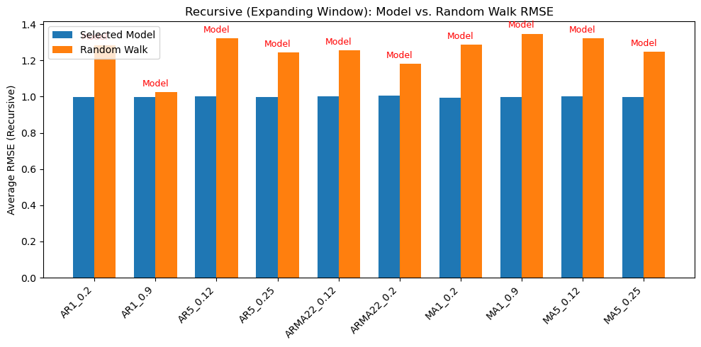

# Random Walk Forecasting Benchmark

Monte Carlo simulation study on the forecasting performance of AR, MA, and ARMA models against random walk benchmarks under varying autocorrelation structures.

---

For Korean readers, a brief summary of the project is provided below.


---

## 1. Project Overview

Random walk models are widely regarded as difficult benchmarks to outperform in macroeconomic and financial forecasting.

This project investigates whether classical time series models can systematically outperform random walk forecasts under different simulated data-generating processes.

Using Monte Carlo simulation, multiple autoregressive and moving-average processes were generated and evaluated under varying levels of autocorrelation persistence. Forecasting performance was then compared against a random walk benchmark using several estimation window strategies and error evaluation metrics.

The project focuses on the relationship between persistence and predictability, examining how forecasting accuracy changes as autocorrelation structures become stronger.

---

## 2. Research Question

This project was designed around the following research questions:

- Can random walk forecasts be consistently outperformed under different autocorrelation structures?
- How does persistence affect forecasting performance across competing time series models?
- Which forecasting estimation window performs best under simulated macroeconomic-style data?
- Does increasing autocorrelation reduce the predictive advantage of more complex models?

---

## 3. Methodology

### Simulated Processes

The following time series processes were simulated using Monte Carlo methods:

- AR(1)
- AR(5)
- MA(1)
- MA(5)
- ARMA(2,2)

Each process was generated under both low-persistence and high-persistence coefficient settings in order to examine how autocorrelation strength affects forecasting performance.

---

### Simulation Design

- Sample size: 500 observations per simulation
- Multiple random seeds were used to ensure reproducibility
- 100 datasets were generated in total
- Simulated data were treated as unknown real-world data during model selection and forecasting stages

---

### Model Identification

Candidate forecasting models were selected using:

- ACF (Autocorrelation Function)
- PACF (Partial Autocorrelation Function)
- Box-Jenkins methodology
- Bayesian Information Criterion (BIC)

The project intentionally evaluates realistic model-selection uncertainty rather than relying solely on the known data-generating process.

---

### Forecasting Framework

Forecasting performance was evaluated using three estimation window strategies:

- Fixed Window
- Rolling Window
- Recursive Window

Each forecasting model was compared against a random walk benchmark.

---

### Evaluation Metrics

Forecasting accuracy was evaluated using:

- RMSE (Root Mean Squared Error)
- MAE (Mean Absolute Error)

Performance comparisons were averaged across multiple simulation runs.


## 4. Diagnostic Analysis and Model Selection

To replicate a realistic forecasting workflow, simulated datasets were treated as unknown real-world data during the identification stage.

Autocorrelation diagnostics were performed using ACF and PACF analysis following the Box-Jenkins methodology. Candidate models were then selected using Bayesian Information Criterion (BIC) in order to balance forecasting performance and model complexity.

The results highlight an important limitation of visual identification methods: higher-order processes with weak coefficients often resemble simpler ARMA-type structures in finite samples.

In several cases, BIC favored parsimonious lower-order models despite the true underlying data-generating process being more complex.

---

### AR(1) Process Diagnostics

The AR(1) simulations demonstrate the classic persistence structure associated with autoregressive processes.

Under high-persistence coefficients, the ACF exhibits slow exponential decay, while the PACF shows a dominant low-order cutoff pattern consistent with autoregressive dynamics.


![[AR1_ACF_PACF.png]](figures/AR1_ACF_PACF.png)


---

### MA(1) Process Diagnostics

The MA(1) simulations display short-memory behavior typical of moving-average processes.

The ACF truncation pattern becomes more pronounced under stronger coefficients, while PACF values decay more gradually due to indirect lag dependence.


![[MA1_ACF_PACF.png]](figures/MA1_ACF_PACF.png)


---


### Higher-Order Processes

For AR(5), MA(5), and ARMA(2,2) processes, visual model identification becomes substantially more difficult.

Both ACF and PACF frequently display gradual decay patterns, making it challenging to distinguish between pure AR, pure MA, and mixed ARMA structures.

This reflects a common practical issue in empirical forecasting applications where finite samples and weak higher-order coefficients obscure the true underlying process.


![[ARMA22_ACF_PACF.png]](figures/ARMA22_ACF_PACF.png)


![[AR5_ACF_PACF.png]](figures/AR5_ACF_PACF.png)


![[MA5_ACF_PACF.png]](figures/MA5_ACF_PACF.png)

---

### Information Criterion Selection

Bayesian Information Criterion (BIC) was used to select forecasting models while penalizing unnecessary model complexity.


![[BIC_result.png]](figures/BIC_result.png)


The table below shows the best fit and complexity models and orders that were selected for each data set based on the combined interpretation of the ACF and PACF plots and the information criteria assessment. 

|           |             |                      |
| --------- | ----------- | -------------------- |
| Model     | Coefficient | Selected Model/Order |
| AR(1)     | 0.20        | AR(1)                |
| AR(1)     | 0.90        | AR(1)                |
| AR(5)     | 0.12        | ARMA(1,1)            |
| AR(5)     | 0.25        | ARMA(1,1)            |
| ARMA(2,2) | 0.12        | AR(1)                |
| ARMA(2,2) | 0.20        | AR(1)                |
| MA(1)     | 0.20        | MA(1)                |
| MA(1)     | 0.90        | MA(1)                |
| MA(5)     | 0.12        | MA(1)                |
| MA(5)     | 0.25        | AR(2)                |

Therefore, by minimizing BIC, complex high-order models were replaced by simpler ones, which is in accordance with the principle of parsimony. Using ACF/PACF visualizations and BIC analysis, The study identified the most appropriate model for each dataset-specific coefficient. I then used these models to compete with the random walk benchmark.

## 5. Forecasting Results

Forecasting performance was evaluated by comparing each selected model against a random walk benchmark across three estimation window strategies:

- Fixed Window
- Rolling Window
- Recursive Window

Performance differences were measured using RMSE and MAE across multiple simulation runs.

The results consistently show that forecasting difficulty increases as autocorrelation becomes stronger, reducing the performance gap between structured forecasting models and the random walk benchmark.

---

### Fixed Window Forecasting

The fixed window approach estimates models using a constant historical training sample throughout the forecasting exercise.

While computationally efficient, this method does not adapt to newly observed data and may therefore struggle under changing dynamics.


![[vsRMSE_fixed.png]](figures/vsRMSE_fixed.png)


Across most simulations, structured forecasting models outperformed the random walk benchmark. However, performance differences narrowed substantially under highly persistent processes.


![[RMSE_scatter_fixed.png]](figures/RMSE_scatter_fixed.png)


---

### Rolling Window Forecasting

The rolling window approach continuously updates the estimation sample using a fixed-length moving training window.

This method is more adaptive to recent observations and short-term structural changes.


![[vsRMSE_rolling.png]](figures/vsRMSE_rolling.png)


The forecasting models generally maintained superior performance relative to the random walk benchmark, although the advantage diminished as autocorrelation increased.


![[RMSE_scatter_rolling.png]](figures/RMSE_scatter_rolling.png)


---

### Recursive Window Forecasting
The recursive window approach continuously expands the training sample as new observations become available.





![[scatter_rmse_recursive.png]](figures/scatter_rmse_recursive.png)


Among all forecasting strategies, recursive estimation consistently produced the strongest forecasting performance across simulations.
The larger information set appears to improve model stability and reduce forecasting variance.

---
### Method Comparison

The three forecasting estimation window strategies were also compared directly across all simulated processes.


![[methodvs.png]](figures/methodvs.png)


Among the evaluated approaches, the recursive window method consistently produced the strongest forecasting performance. By continuously expanding the training sample and incorporating newly observed data, the recursive strategy achieved lower forecasting errors across most simulations.

The results suggest that larger and continuously updated information sets improve forecasting stability and predictive accuracy in autoregressive and moving-average environments.


## 6. Key Findings

- Random walk forecasts become increasingly difficult to outperform as autocorrelation strength increases.

- Highly persistent autoregressive processes reduce the forecasting advantage of more complex time series models.

- Recursive window estimation consistently achieved the strongest forecasting performance across simulations.

- BIC frequently selected simpler lower-order models as parsimonious approximations to more complex generating processes.

- Finite-sample effects and weak higher-order coefficients often complicate visual model identification using ACF and PACF diagnostics.

- Structured forecasting models generally outperformed the random walk benchmark under most simulated environments.

## 7. Repository Structure

```plaintext
random-walk-forecasting-benchmark/
│
├── notebooks/
│   ├── random-walk-forecasting-benchmark.ipynb
│
├── figures/
│   ├── BIC_result.png
│   ├── AR1_ACF_PACF.png
│   ├── AR5_ACF_PACF.png
│   └── ...
│
└── README.md
```

---

## 8. Reproducibility

All simulations were generated using fixed random seeds to ensure reproducibility across forecasting experiments.

The repository includes the complete workflow for:

- Simulating time series processes
- Performing model identification
- Running forecasting exercises
- Comparing benchmark forecasting performance

All analysis was conducted using Python-based statistical and forecasting libraries.

---

## 9. Tools and Libraries

The project was implemented using the following tools and libraries:

- Python
- NumPy
- pandas
- statsmodels
- matplotlib
- scikit-learn
- Jupyter Notebook

---

## 10. Future Improvements

Possible extensions of this project include:

- Evaluating non-stationary and near-unit-root processes
- Extending the framework to multi-step forecasting
- Comparing classical time series models against machine learning approaches
- Testing forecasting performance under structural breaks and regime changes
- Incorporating real macroeconomic and financial datasets

---

## 11. Korean Summary (한국어 요약)

이 프로젝트는 Monte Carlo simulation을 활용하여  
AR, MA, ARMA 모델과 Random Walk benchmark의 forecasting 성능을 비교한 연구 프로젝트입니다.

자기상관성이 강해질수록 Random Walk를 outperform하기 어려워진다는 점을 확인했으며,  
Recursive window 방식이 가장 안정적인 forecasting 성능을 보였습니다.

또한 ACF/PACF 기반 모델 식별과 BIC 기반 모델 선택 과정을 통해  
실제 시계열 forecasting workflow를 재현했습니다.
